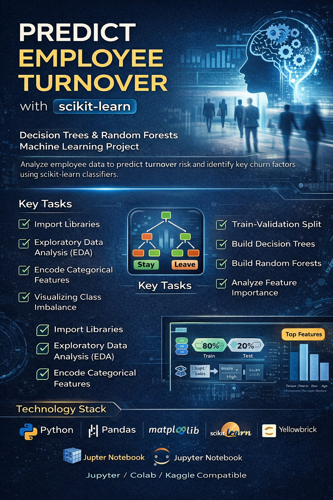

# 📊 Predict Employee Turnover using Scikit-Learn

A machine learning project focused on predicting **employee churn (turnover)** using **Decision Trees** and **Random Forest classifiers**.  
The project demonstrates a complete end-to-end ML workflow, from exploratory data analysis to model evaluation and feature importance interpretation.

---

## 📌 Project Overview

Employee turnover is a major challenge for organizations, leading to increased recruitment costs, loss of productivity, and operational disruption.  
This project applies **supervised machine learning** techniques to predict whether an employee is likely to leave the organization based on historical HR data.

The models are built using **scikit-learn** and emphasize **interpretability, performance comparison, and feature impact analysis**.

---

## 🎯 Objectives

- Explore employee data and identify churn-related patterns
- Handle categorical variables through encoding
- Address class imbalance using stratified sampling
- Train and evaluate Decision Tree and Random Forest models
- Compare performance across models
- Interpret feature importance to understand key drivers of churn

---

## 🧪 Project Workflow

### **Task 1: Import Libraries**
- Imported essential modules from:
  - NumPy
  - Pandas
  - Matplotlib
  - Scikit-learn
  - Yellowbrick

---

### **Task 2: Exploratory Data Analysis (EDA)**
- Loaded the employee dataset using pandas
- Visualized relationships between features and employee turnover
- Identified trends and potential predictors of churn

---

### **Task 3: Encode Categorical Features**
- Categorical variables:
  - **Department**
  - **Salary**
- Applied **dummy encoding** to convert them into numerical features suitable for ML models

---

### **Task 4: Visualize Class Imbalance**
- Used **Yellowbrick’s Class Balance Visualizer**
- Analyzed churn vs non-churn distribution
- Insights informed sampling strategy during model training

---

### **Task 5: Train–Validation Split**
- Split dataset into **80% training / 20% validation**
- Applied **stratified sampling** to preserve class proportions

---

### **Tasks 6 & 7: Decision Tree Classifier**
- Built a Decision Tree model using scikit-learn
- Used `interact` to create interactive controls for hyperparameters
- Trained and evaluated the model
- Calculated training and validation accuracy
- Visualized the fitted decision tree

---

### **Task 8: Random Forest Classifier**
- Built a Random Forest model to address Decision Tree variance
- Used interactive controls for hyperparameter tuning
- Trained and evaluated the model
- Visualized individual trees from the forest

---

### **Task 9: Feature Importance & Evaluation**
- Extracted feature importance using:
  - `feature_importances_` attribute
- Ranked and visualized the most influential features
- Compared Decision Tree vs Random Forest performance

---

## 📈 Results & Insights

- **Random Forest** achieved better generalization and stability than Decision Tree
- Feature importance analysis revealed key drivers of employee turnover
- Interactive hyperparameter tuning improved understanding of model behavior

---

## 🛠️ Technology Stack

- Python  
- Pandas & NumPy  
- Matplotlib  
- Scikit-learn  
- Yellowbrick  
- Jupyter Notebook / Google Colab  

---

## 🚀 Future Improvements

- Hyperparameter optimization using GridSearchCV
- Handling imbalance with SMOTE
- Model explainability using SHAP
- Deployment as a web-based HR analytics tool
- Adding additional ML models (XGBoost, Gradient Boosting)

---

## 📄 License

This project is released under the **MIT License**.
